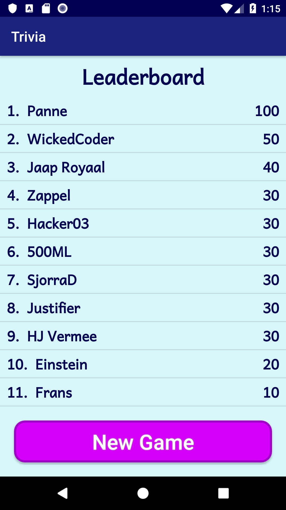

## Trivia (Android App)

*Anne Hoogerduijn Strating*
*12441163*

A quiz game that presents trivia questions. The player gets to choose the amount of questions and the difficulty level.
At the end of the quiz the player can submit his or her score to the leaderboard.

 

 

